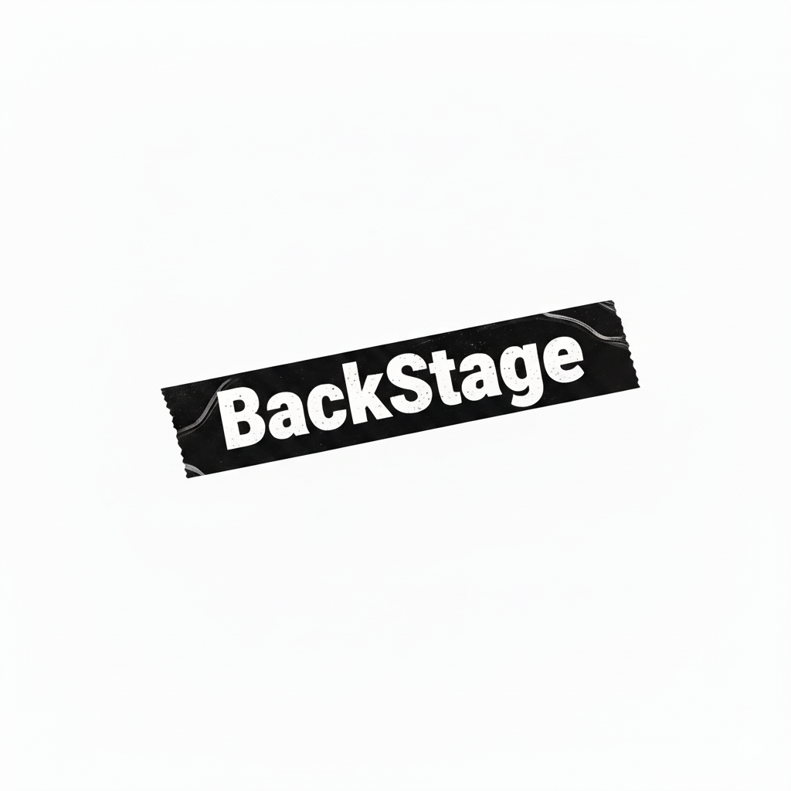

<!--

Comme on a déjà un super nom, on a fait 90% du travail.
Ce qu'on vous propose aujourd'hui, c'est de faire les 10% restants ensemble, en utilisant les méthodologies du Domain-Driven Design.

-->

---
layout: image-right
image: ../assets/mixer.jpg
---

## Business concepts ?

 
 

### <v-click> Musician</v-click>

### <v-click> Instrument</v-click>

### <v-click> Studio</v-click>

### <v-click> Marketplace</v-click>

### <v-click> Ad</v-click>

### <v-click> to apply a discount</v-click>

### <v-click> make a price proposition</v-click>

### <v-click> place an alert</v-click>

### <v-click>pay</v-click>

<!--
Quels sont les concepts métiers importants que l'on retient ?

Musicien
Studio
Instrument
Annonce
Prix
Faire une Proposition de prix
Alerte
appliquer un discount
-->
--- 
class: text-center
layout: center
---

## UBIQUITOUS LANGUAGE

<!--
Ce qu'on vient de faire, c'est commencer à construire un langage commun entre nous, développeurs, et les experts métiers.

Le language ubiquitaire.

-->

--- 
layout: image
image: ../assets/projet-informatique.jpg
backgroundSize: contain
---

<!--

Ce qu'on veut, c'est lever toutes les ambiguités sur le vocabulaire métier.
Avoir des termes précis, partagés, et compris par tous.

Le piège c'est d'avoir des termes qui veulent dire plusieurs choses, selon les personnes à qui on parle.

Et en tant que développeur, on a une grosse responsabilité sur ce vocabulaire, 
car on a tendance à introduire des termes techniques (biais du dev) qui n'ont pas de sens pour les experts métiers.

-->

--- 
class: text-center
layout: center
---

<!--

On veut construire un model mental partagé avec tout le monde et dans le code.

Mais qu'est-ce qu'un modèle ?

-->

---
layout: image
image: ../assets/paris.jpg
backgroundSize: contain
---

---
layout: image
image: ../assets/paris-map.jpg
backgroundSize: contain
---

---
layout: image
image: ../assets/paris-metro.png
backgroundSize: contain
---

---
layout: quote
---

# "All the models are wrong, but some are useful"

George E. P. Box

<!--

Ce qu'on veut, c'est un model simple, utile dans un contexte donné. 

Car si on veut faire un model qui couvre tout le domaine métier, 
on va se retrouver avec une God Class.

-->

---
class: text-center
layout: center
---

<!--
On veut éviter ça...

-->

---
class: text-center
layout: center
---

## Bounded Context

<!--

Ca tombe bien, pour ça DDD nous donne la notion de bounded Context.

Un bounded contexte, c'est une limite explicite autour d'un langage ubiquitaire via un modèle spécifique.

Il va permettre de définir des frontières dans lesquelles un modèle spécifique s'applique.

Mais comment trouver ces frontières ?
-->

---
class: text-center
layout: center
---

## Sub-domains

<!--
Les sous-domaines vont nous aider à structurer notre domaine métier.

Un sous-domaine est une partie du domaine métier qui a une responsabilité spécifique. 
Un ensemble de capacités métier cohérentes. 

Quels sont les sous-domaines dans notre application ?

Studio
Vente d'instruments: Marketplace
Gestion des comptes utilisateurs
Gestion des notifications
Alerting
Payments
-->

---
class: text-center
layout: image-left
image: ../assets/guitar.jpg
---

## Sub-domains typologies

  
<h3 v-click>Core Domain</h3>
<h3 v-click>Supporting Subdomain</h3>
<h3 v-click>Generic Subdomain</h3>

<!--
On peut découper le domaine métier en sous-domaines.
[click] Le Core Domain est le sous-domaine principal, celui qui apporte de la valeur différenciante à l'entreprise.

[click] Le Supporting Subdomain est un sous-domaine qui apporte de la valeur, mais qui n'est
pas différenciante. (ex: un catalogue de produits)

[click] Le Generic Subdomain est un sous-domaine qui n'apporte pas de valeur différenciante, et qui peut être externalisé. (ex: gestion des notifications, gestion des paiements, etc...)

-->

---
layout: image
image: ../assets/core-domain-chart.jpg
backgroundSize: 65% 90%
---

source: https://ddd-crew.github.io/ddd-starter-modelling-process/

<!--
Ici quel est notre core-domain?
Quels sont les supporting subdomains?
Quels sont les generic subdomains?

Grace à ce découpage, on va pouvoir aligner les bounded contexts.
L'alignement entre les sous-domaines et les bounded contextes n'est pas forcément 1:1, mais c'est souvent le cas.

C'est un choix d'architecture important à faire en amont du projet.
-->

---
layout: image-right
image: ../assets/mic.jpg
---

## Strategic patterns

<!--

Tout ce dont on a parlé jusqu'à présent (ubiquitous language, bounded-contexts, sub-domains), ça fait partie des patterns stratégiques.

C'est un des pans, si ce n'est le pan le plus important du DDD.

Il y a plein de chose à creuser là-dedans, et il y a plein d'ateliers possibles, comme par exemple l'Event Storming.

-->

---
layout: image
image: ../assets/event-storming.png
backgroundSize: contain
---

---
layout: image-left
image: ../assets/amp.jpg
---

## Tactical patterns
 
 
<h3 v-click>Entities</h3>
<h3 v-click>Value objects</h3>
<h3 v-click>Aggregates</h3>
<h3 v-click>Domain service</h3>
<h3 v-click>Domain events</h3>

<!--

Mais on a choisi aujourd'hui de se concentrer beaucoup plus longuement sur les patterns tactiques.
Car c'est souvent le point d'entrée des développeurs dans le DDD, et la conference est orientée code.

Maintenant il est important de comprendre que le DDD ne se limite pas aux patterns tactiques, et qu'au contraire
le DDD commence par les patterns stratégiques (pas de tactique sans stratégie).
-->
