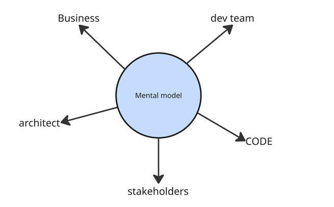

# DDD in practice

<!--
Ok assez de théorie, on va essayer de mettre en lumière les concepts de DDD à travers un atelier pratique.

histoire de musiciens
-->

---
layout: center
class: text-center
---

# BackStage

### Application de vente d'instruments de musique entre musiciens

<!--
- un musicien peut ajouter des instruments dans son studio afin de partager des infos.
- un musicien peut publier une annonce pour vendre un instrument de son studio.
- une annonce peut être mise en pause (si le vendeur est indisponible pendant une période).
- le musicien vendeur définit un prix pour son instrument lors de la publication de l'annonce.
- Il peut appliquer une réduction sur le prix de son annonce.
- un musicien peut directement acheter un instrument depuis l'annonce.
- un musicien peut faire une proposition de prix, sous forme d'un pourcentage de réduction sur le prix affiché.
- le musicien vendeur peut accepter ou refuser une proposition de prix.
- un musicien peut mettre des alertes sur un instrument afin d'être notifié lorsqu'une annonce est publiée pour cet
  instrument.
-->

---
class: text-center
layout: center
---

### Concepts métiers ?

<!--
Quels sont les concepts métiers importants que l'on retient ?

Musicien
Instrument
Studio
Annonce
Prix
Proposition de prix
Alerte
-->
--- 
class: text-center
layout: center
---

### UBIQUITOUS LANGUAGE

<!--
Ce qu'on vient de faire, c'est commencer à construire un langage commun entre nous, développeurs, et les experts métiers.

Le language ubiquitaire.

-->

--- 
class: text-center
layout: center
---

---
class: text-center
layout: center
---

Problem space vs Solution space

<!--
Ce qui est important, c'est de bien rester dans l'espace du problème, 
et ne pas rentrer dans la solution technique.
On reste sur "quoi", le "pourquoi", et pas le "comment". On cherche les termes précis, rendre explicite les règles implicites,
comprendre quel problème on cherche à résoudre.

Dans le solution space, on va créer un modèle technique, une architecture, des choix technologiques, etc...

Ca parait évident, mais en tant que développeurs, on a tendance naturellement à penser "base de données", "table", "API REST", etc...
C'est un biais naturel dont il faut avoir conscience.
-->
---
class: text-center
layout: center
---

# Subdomains & Bounded Contexts

<!--
Maintenant qu'on a un vocabulaire commun, on va pouvoir commencer à structurer notre domaine métier.
On va commencer par découper le domaine métier en sous-domaines, puis on va définir des Bounded Contexts.

Un sous-domaine est une partie du domaine métier qui a une responsabilité claire. Un ensemble de capacités métier cohérentes.

Quels sont les sous-domaines dans notre application ?

Gestion du studio de musique
Vente d'instruments: Marketplace
Gestion des utilisateurs
Gestion des notifications
Gestion des alertes
-->

---
class: text-center
layout: center
---

# Subdomains

  
Core Domain

  
Supporting Subdomain

  
Generic Subdomain

<!--
On peut découper le domaine métier en sous-domaines.
[click] Le Core Domain est le sous-domaine principal, celui qui apporte de la valeur différenciante à l'entreprise.

[click] Le Supporting Subdomain est un sous-domaine qui apporte de la valeur, mais qui n'est
pas différenciante. (ex: un catalogue de produits)

[click] Le Generic Subdomain est un sous-domaine qui n'apporte pas de valeur différenciante, et qui peut être externalisé. (ex: gestion des notifications, gestion des paiements, etc...)

Ici quel est notre code-domain?
Quels sont les supporting subdomains?
Quels sont les generic subdomains?
-->

---
class: text-center
layout: center
transition: slide-up
level: 2
---

# Bounded Context

<!--
Maintenant qu'on a découpé le domaine métier en sous-domaines, on va pouvoir définir des Bounded Contexts.

Un Bounded Context est une limite explicite autour d'un langage ubiquitaire via un modèle spécifique.

Ce qu'on cherche à éviter, c'est d'avoir un modèle unique qui couvre tout le domaine métier.
-->

---
class: text-center
layout: center
---

---
class: text-center
layout: center
---

# Bounded Context

 
 

Limite explicite du modèle

Ubiquitous Language spécifique

Responsabilité claire

<!--

Il a une intégration explicite avec les autres Bounded Contexts, et une responsabilité claire.

Il est fait partie du design et donc de l'espace de la solution.

Il peut être aligné avec un sous-domaine, mais ce n'est pas obligatoire.

On va organiser les équipes autour des Bounded Contexts.

Comment on travaille nos modèles métiers et nos Bounded Contexts ?
par des ateliers de modélisation comme par exemple l'event storming ou l'example mapping...

Il y a énormément à dire sur la partie stratégique du DDD, 
, mais on va se concentrer aujourd'hui sur la partie tactique.

On vous donnera en fin d'atelier des ressources pour aller plus loin (ddd-starter-modeling-process)

TODO: montrer le resultat d'un event storming sur ce domaine

-->

