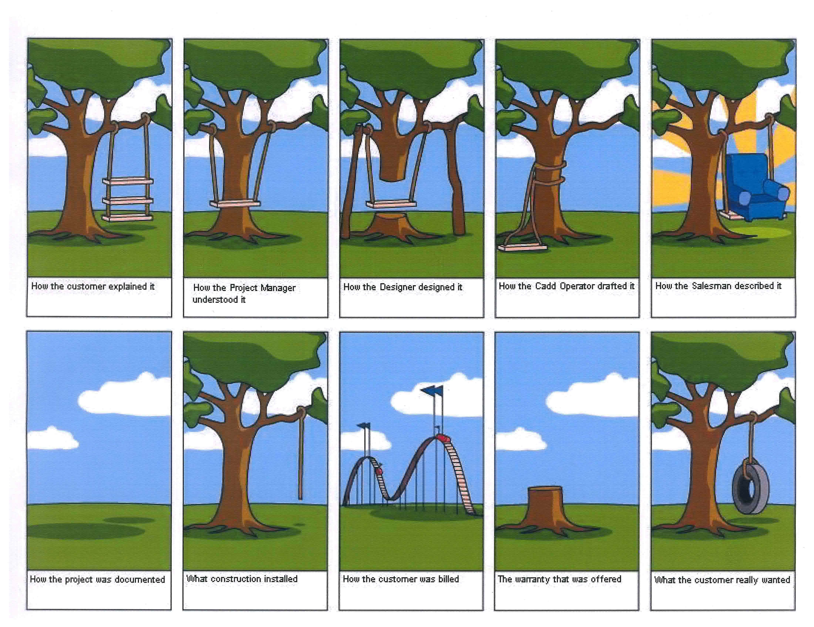

---
layout: center
class: text-center
---

---
layout: center
class: text-center
---

# What is DDD?

---
layout: center
class: text-center
---
<v-click>

The DDD methodology offers a set of practices for a
collaborative approach to software
development,
from the perspective of  the business .

</v-click>

<!--
[click] Domain-Driven Design c'est 

[click] une méthodologie qui propose 

[click]un ensemble de pratiques pour une approche collaborative du développement logiciel, du point de vue

[click] du métier.

On va voir ensemble quelles sont ces pratiques.
-->

---
layout: two-cols
class: text-center
---

::default::

## Strategic patterns

 
    
Bounded Context

    
Ubiquitous Language

    
Context Map

 
 

::right::

## Tactical patterns

 
    
Entities

    
Value Objects

    
Aggregates

    
Domain Services

    
Repositories

    
Domain Events

<!--
[click] Dans la boite à outils du DDD, on trouve des patterns stratégiques 
[click] et tactiques.

Les patterns stratégiques vont nous permettre de mieux comprendre le domaine métier,
de mieux communiquer avec les experts métiers,
de trouver un language commun et de construire un modèle partagé.

Pour ça on va avoir comme outils
[click] le Bounded Context,
[click] le Language Ubiquitaire
[click] et la Context Map.

Les patterns tactiques vont nous permettre de structurer notre code
afin de refléter le modèle métier que l'on a construit, grâce
[click] aux Entities,
[click] aux Value Objects,
[click] aux Aggregates,
[click] aux Domain Services,
[click] aux Repositories
[click] et aux Domain Events.

[click] On a choisi aujourd'hui de se concentrer beaucoup plus longuement sur les patterns tactiques.
Car c'est souvent le point d'entrée des développeurs dans le DDD, et la conference est orientée code.

Maintenant il est important de comprendre que le DDD ne se limite pas aux patterns tactiques, et qu'au contraire
le DDD commence par les patterns stratégiques (pas de tactique sans stratégie).
-->
