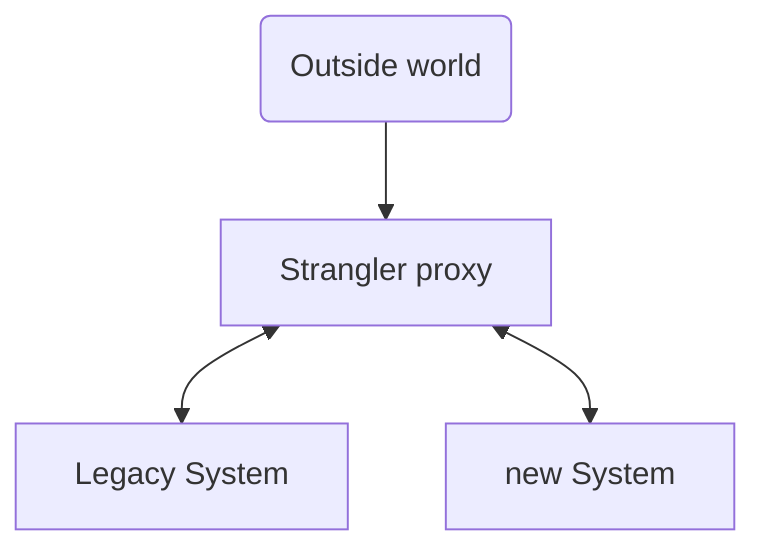

# Wrap-up

---
layout: center
class: text-center
---

Value Object

Aggregate

Domain Service

 

Domain Event

---
layout: center
class: text-center
---

### Domain Driven Design

 

Not a framework...

more like a toolbox

not only code

<!--
TODO: montrer le resultat d'un event storming sur ce domaine

On remontre l'event storming et le fait que tout était déjà là.
L'importance des patterns stratégiques pour bien comprendre le domaine avant de se lancer dans la solution.

On a rendu explicite tout ce qui était implicite dans nos têtes.

-->
---
layout: center
class: text-center
---

### Warnings

 

Not a silver bullet

somethimes CRUD is more relevant

easy to understand hard to master

iterative

be careful of the "by the book"

<!--

-->
---
layout: center
class: text-center
---

# What about legacy code?

 

use value object

move invariants

identify and isolate bounded contexts

<!--
Comment migrer un legacy vers du DDD ?

On n'est pas obligé d'utiliser tous les patterns DDD.
- Commencer par les plus simples: les value objects.

- Est-ce possible de déplacer les invariants métier dans les entités?

- Bien identifier les Bounded Contexts
- Isoler les Bounded Contexts
- strangler pattern
-->

---
layout: center
class: text-center
---

---
layout: center
class: text-center
---

# Strangler pattern

---
layout: center
class: text-center
---

# Last words

 

<i>Take care of your model if you don't want to eat your cat's sh*t</i>

