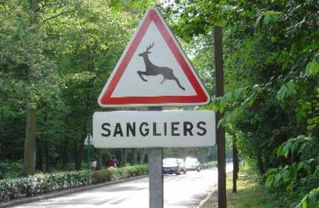

## Wrap-up

---
layout: center
class: text-center
---

## Domain Driven Design

 
 
 

<v-click>

The DDD methodology offers a set of practices for a
collaborative approach to software
development,
from the perspective of  the business .

</v-click>

<!--
[click] Domain-Driven Design c'est 

[click] une méthodologie qui propose 

[click]un ensemble de pratiques pour une approche collaborative du développement logiciel, du point de vue

[click] du métier.
-->

---
layout: center
class: text-center
---

---
layout: image-left
image: ../assets/guitar.jpg
---

## Domain Driven Design

 
 
 

<h3 v-click>Not a framework...</h3>
<h3 v-click>more like a toolbox</h3>
<h3 v-click>not only code</h3>

<!--

-->

---
layout: image
image: ../assets/event-storming.png
backgroundSize: contain
---

<!--
Tout était déjà là.
L'importance des patterns stratégiques pour bien comprendre le domaine avant de se lancer dans la solution.

On a rendu explicite tout ce qui était implicite dans nos têtes.
-->

---
layout: image-right
image: ../assets/bass.jpg
---

## Warnings

 
 
 

<h3 v-click>Not a silver bullet</h3>
<h3 v-click>sometimes CRUD is more relevant</h3>
<h3 v-click>easy to understand hard to master</h3>
<h3 v-click>iterative</h3>
<h3 v-click>be careful of the "by the book"</h3>

<!--

-->
---
layout: image-left
image: ../assets/drums.jpg
---

## What about legacy code?

 
 
 

<h3 v-click>use value object</h3>
<h3 v-click>move invariants</h3>
<h3 v-click>identify and isolate bounded contexts</h3>

<!--
Comment migrer un legacy vers du DDD ?

On n'est pas obligé d'utiliser tous les patterns DDD.
- Commencer par les plus simples: les value objects.

- Est-ce possible de déplacer les invariants métier dans les entités?

- Bien identifier les Bounded Contexts
- Isoler les Bounded Contexts
- strangler pattern
-->

---
layout: center
class: text-center
---

## Last words

 
 
 

<i>Take care of your model if you don't want to eat your cat's sh*t</i>

